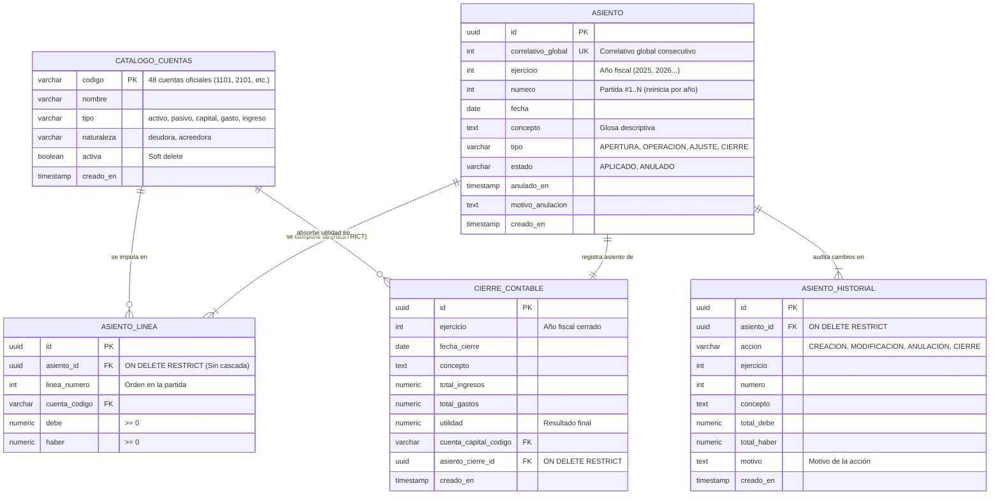

# Diseño y Script de Base de Datos Contable

> **Proyecto:** Sistema Contable Automatizado  
> **Origen:** Extraído y analizado desde `aplicacion-contable.zip`  
> **Motor Sugerido:** PostgreSQL 14+ (compatible con Supabase, Neon, AWS RDS, Docker)  
> **Principio de Inmutabilidad:** Enfoque **No Destructivo**. Los registros contables y asientos históricos se conservan íntegramente para auditoría.

---

## 1. Análisis del Dominio y Decisiones de Diseño

Para que la base de datos sea fiel al frontend de Next.js ([`lib/types.ts`](file:///home/damian/aplicacion-contable/lib/types.ts), [`lib/contabilidad.ts`](file:///home/damian/aplicacion-contable/lib/contabilidad.ts)) y respete las normas internacionales de contabilidad:

1. **`codigo` como Clave Primaria Natural:**
   - La entidad `Cuenta` no necesita un UUID intermedio. El código contable (`1101`, `2101`, etc.) es inmutable y sirve como clave primaria, simplificando las consultas y la conexión con el frontend.
2. **Inmutabilidad y Auditoría (Sin borrado de historia):**
   - El ciclo contable se cierra mediante un **Asiento de Cierre** (liquidación formal de ingresos y gastos hacia utilidades acumuladas). **No se utiliza `DELETE` en ningún momento**.
3. **Mayorización Dinámica (Vistas en lugar de tablas redundantes):**
   - El **Libro Mayor**, el **Balance de Comprobación**, el **Estado de Resultados** y el **Balance General** se calculan en tiempo real a través de vistas SQL.
4. **Orden de Renglones Garantizado:**
   - Se incluye `linea_numero` en `asiento_linea` para asegurar que los cargos y abonos se presenten siempre en el orden en que fueron capturados.
5. **Partida Doble y Exclusividad:**
   - Restricción estricta `chk_linea_exclusiva` (`(debe > 0 AND haber = 0) OR (haber > 0 AND debe = 0)`).
6. **Numeración por Ejercicio Fiscal y Correlativo Global:**
   - `correlativo_global`: Consecutivo ininterrumpido único a lo largo de toda la historia de la empresa para trazabilidad fiscal electrónica.
   - `numero`: Se reinicia automáticamente a 1 al comenzar cada nuevo año o ejercicio contable (`1..N`), garantizado por la restricción `UNIQUE (ejercicio, numero)`.
7. **Prohibición de Eliminación en Cascada (Auditoría Obligatoria):**
   - Las líneas de asiento tienen `ON DELETE RESTRICT`. Nunca se borran asientos con líneas asociadas.
   - Las partidas no se eliminan físicamente: se anulan formalmente (`estado = 'ANULADO'`, `anulado_en`, `motivo_anulacion`) mediante el procedimiento `sp_anular_asiento`.
   - Toda creación, anulación o cierre genera una traza inmutable en la tabla `asiento_historial`.
8. **Adopción Estricta del Método Analítico o Pormenorizado:**
   - A diferencia del método de Inventarios Perpetuos, el **Método Analítico** abre una cuenta nominal o de resultados específica para cada operación relacionada con la mercadería:
     * `1104 Inventario de mercadería`: Registra únicamente el inventario inicial al inicio del ejercicio (permanece inalterado hasta el inventario físico final).
     * `4101 Compras`: Se debita por las adquisiciones de mercancías al precio de adquisición.
     * `4102 Gastos sobre compras`: Se debita por fletes, acarreos, seguros y derechos aduanales asociados a la compra.
     * `4103 Devoluciones sobre ventas`: Se debita por el precio de venta de las mercancías devueltas por clientes.
     * `4104 Rebajas y descuentos sobre ventas`: Se debita por bonificaciones y rebajas sobre precios de venta otorgados a clientes.
     * `5101 Ventas`: Se acredita por las ventas realizadas al precio comercial (sin registrar costo de venta por cada transacción individual).
     * `5102 Devoluciones sobre compras`: Se acredita por las mercancías devueltas a proveedores.
     * `5103 Rebajas y descuentos sobre compras`: Se acredita por las rebajas o bonificaciones otorgadas por proveedores.
   - **Fórmula Cascada del Estado de Resultados (Método Analítico):**
     * **Ventas Netas** = Ventas Totales (5101) - Devoluciones s/ventas (4103) - Rebajas s/ventas (4104)
     * **Compras Totales** = Compras (4101) + Gastos s/compras (4102)
     * **Compras Netas** = Compras Totales - Devoluciones s/compras (5102) - Rebajas s/compras (5103)
     * **Total de Mercancías Disponibles** = Inventario Inicial (1104) + Compras Netas
     * **Costo de Ventas (Costo de lo Vendido)** = Total de Mercancías - Inventario Final
     * **Utilidad Bruta** = Ventas Netas - Costo de Ventas
     * **Utilidad de Operación** = Utilidad Bruta - Gastos de Operación (42xx)
     * **Utilidad Neta** = Utilidad de Operación ± Gastos/Productos Financieros y Otros
   - Cuenta con la vista SQL nativa `vista_estado_resultados_analitico` que calcula automáticamente cada renglón de esta fórmula.

---

## 2. Diagrama Entidad-Relación (ERD)



---

## 3. Script SQL Completo (DDL, Vistas y Cierre No Destructivo)

```sql
-- =============================================================================
-- SISTEMA CONTABLE AUTOMATIZADO - SCRIPT DEFINITIVO NO DESTRUCTIVO (POSTGRESQL 14+)
-- Sincronización 1:1 con Next.js + Auditoría e Historial Intacto (Sin DELETE)
-- =============================================================================

CREATE EXTENSION IF NOT EXISTS "pgcrypto";

-- 1. LIMPIEZA PREVENTIVA
DROP VIEW IF EXISTS vista_balance_general CASCADE;
DROP VIEW IF EXISTS vista_estado_resultados CASCADE;
DROP VIEW IF EXISTS vista_estado_resultados_detalle CASCADE;
DROP VIEW IF EXISTS vista_balance_comprobacion CASCADE;
DROP VIEW IF EXISTS vista_libro_mayor CASCADE;
DROP VIEW IF EXISTS vista_libro_diario CASCADE;

DROP TABLE IF EXISTS asiento_linea CASCADE;
DROP TABLE IF EXISTS asiento CASCADE;
DROP TABLE IF EXISTS catalogo_cuentas CASCADE;

-- 2. TABLA: CATÁLOGO DE CUENTAS (lib/types.ts -> interface Cuenta)
CREATE TABLE catalogo_cuentas (
    codigo VARCHAR(20) PRIMARY KEY,
    nombre VARCHAR(150) NOT NULL,
    tipo VARCHAR(20) NOT NULL CHECK (tipo IN ('activo', 'pasivo', 'capital', 'gasto', 'ingreso')),
    naturaleza VARCHAR(20) NOT NULL CHECK (naturaleza IN ('deudora', 'acreedora')),
    activa BOOLEAN NOT NULL DEFAULT TRUE,
    creado_en TIMESTAMP WITH TIME ZONE NOT NULL DEFAULT CURRENT_TIMESTAMP,
    CONSTRAINT chk_codigo_digito CHECK (
        (codigo LIKE '1%' AND tipo = 'activo'  AND naturaleza = 'deudora') OR
        (codigo LIKE '2%' AND tipo = 'pasivo'  AND naturaleza = 'acreedora') OR
        (codigo LIKE '3%' AND tipo = 'capital' AND naturaleza = 'acreedora') OR
        (codigo LIKE '4%' AND tipo = 'gasto'   AND naturaleza = 'deudora') OR
        (codigo LIKE '5%' AND tipo = 'ingreso' AND naturaleza = 'acreedora')
    )
);

CREATE INDEX idx_catalogo_tipo ON catalogo_cuentas(tipo);
CREATE INDEX idx_catalogo_activa ON catalogo_cuentas(activa);

-- 3. TABLA: ASIENTOS (CABECERA LIBRO DIARIO) (lib/types.ts -> interface Asiento)
CREATE TABLE asiento (
    id UUID PRIMARY KEY DEFAULT gen_random_uuid(),
    numero INT GENERATED BY DEFAULT AS IDENTITY UNIQUE,
    ejercicio INT NOT NULL DEFAULT EXTRACT(YEAR FROM CURRENT_DATE)::INT,
    fecha DATE NOT NULL DEFAULT CURRENT_DATE,
    concepto TEXT NOT NULL,
    tipo VARCHAR(20) NOT NULL DEFAULT 'OPERACION' CHECK (tipo IN ('APERTURA', 'OPERACION', 'AJUSTE', 'CIERRE')),
    creado_en TIMESTAMP WITH TIME ZONE NOT NULL DEFAULT CURRENT_TIMESTAMP
);

CREATE INDEX idx_asiento_fecha ON asiento(fecha);
CREATE INDEX idx_asiento_ejercicio ON asiento(ejercicio);

-- 4. TABLA: LÍNEAS DEL ASIENTO (lib/types.ts -> interface AsientoLinea)
CREATE TABLE asiento_linea (
    id UUID PRIMARY KEY DEFAULT gen_random_uuid(),
    asiento_id UUID NOT NULL REFERENCES asiento(id) ON DELETE CASCADE,
    linea_numero INT NOT NULL DEFAULT 1,
    cuenta_codigo VARCHAR(20) NOT NULL REFERENCES catalogo_cuentas(codigo) ON DELETE RESTRICT,
    debe NUMERIC(14, 2) NOT NULL DEFAULT 0.00 CHECK (debe >= 0),
    haber NUMERIC(14, 2) NOT NULL DEFAULT 0.00 CHECK (haber >= 0),
    CONSTRAINT uq_asiento_linea UNIQUE (asiento_id, linea_numero),
    CONSTRAINT chk_linea_exclusiva CHECK (
        (debe > 0 AND haber = 0) OR 
        (haber > 0 AND debe = 0)
    )
);

CREATE INDEX idx_linea_asiento ON asiento_linea(asiento_id);
CREATE INDEX idx_linea_cuenta ON asiento_linea(cuenta_codigo);

-- 5. TABLA: HISTORIAL DE CIERRES CONTABLES (Auditoría de cierres fiscales)
CREATE TABLE cierre_contable (
    id UUID PRIMARY KEY DEFAULT gen_random_uuid(),
    ejercicio INT NOT NULL,
    fecha_cierre DATE NOT NULL DEFAULT CURRENT_DATE,
    concepto TEXT NOT NULL DEFAULT 'Cierre del ejercicio fiscal',
    total_ingresos NUMERIC(14, 2) NOT NULL DEFAULT 0.00,
    total_gastos NUMERIC(14, 2) NOT NULL DEFAULT 0.00,
    utilidad NUMERIC(14, 2) NOT NULL DEFAULT 0.00,
    cuenta_capital_codigo VARCHAR(20) NOT NULL REFERENCES catalogo_cuentas(codigo),
    asiento_cierre_id UUID NOT NULL REFERENCES asiento(id),
    creado_en TIMESTAMP WITH TIME ZONE NOT NULL DEFAULT CURRENT_TIMESTAMP
);

CREATE INDEX idx_cierre_ejercicio ON cierre_contable(ejercicio);
CREATE INDEX idx_cierre_fecha ON cierre_contable(fecha_cierre);

-- -----------------------------------------------------------------------------
-- 6. VISTAS DEL CICLO CONTABLE
-- -----------------------------------------------------------------------------

-- 5.1. Libro Diario consolidado (orden cronológico y de renglones garantizado)
CREATE OR REPLACE VIEW vista_libro_diario AS
SELECT 
    a.id AS asiento_id,
    a.numero AS partida_numero,
    a.ejercicio,
    a.fecha,
    a.concepto,
    a.tipo AS tipo_asiento,
    al.linea_numero,
    c.codigo AS cuenta_codigo,
    c.nombre AS cuenta_nombre,
    c.tipo AS cuenta_tipo,
    c.naturaleza AS cuenta_naturaleza,
    al.debe,
    al.haber
FROM asiento a
JOIN asiento_linea al ON a.id = al.asiento_id
JOIN catalogo_cuentas c ON al.cuenta_codigo = c.codigo
ORDER BY a.fecha DESC, a.numero DESC, al.linea_numero ASC;

-- 5.2. Libro Mayor (lib/contabilidad.ts -> calcularMayor)
CREATE OR REPLACE VIEW vista_libro_mayor AS
SELECT 
    c.codigo AS cuenta_codigo,
    c.nombre AS cuenta_nombre,
    c.tipo AS cuenta_tipo,
    c.naturaleza AS cuenta_naturaleza,
    c.activa,
    ROUND(SUM(al.debe), 2) AS total_debe,
    ROUND(SUM(al.haber), 2) AS total_haber,
    ROUND(SUM(al.debe) - SUM(al.haber), 2) AS saldo_neto,
    CASE 
        WHEN ROUND(SUM(al.debe) - SUM(al.haber), 2) > 0 THEN 'deudora'
        WHEN ROUND(SUM(al.debe) - SUM(al.haber), 2) < 0 THEN 'acreedora'
        ELSE NULL 
    END AS naturaleza_saldo,
    CASE 
        WHEN c.naturaleza = 'deudora' THEN ROUND(SUM(al.debe) - SUM(al.haber), 2)
        ELSE ROUND(SUM(al.haber) - SUM(al.debe), 2)
    END AS saldo_normalizado
FROM catalogo_cuentas c
JOIN asiento_linea al ON c.codigo = al.cuenta_codigo
GROUP BY c.codigo, c.nombre, c.tipo, c.naturaleza, c.activa
HAVING SUM(al.debe) <> 0 OR SUM(al.haber) <> 0;

-- 5.3. Balance de Comprobación
CREATE OR REPLACE VIEW vista_balance_comprobacion AS
SELECT 
    cuenta_codigo,
    cuenta_nombre,
    cuenta_tipo,
    total_debe,
    total_haber,
    CASE WHEN saldo_neto > 0 THEN saldo_neto ELSE 0.00 END AS saldo_deudor,
    CASE WHEN saldo_neto < 0 THEN ABS(saldo_neto) ELSE 0.00 END AS saldo_acreedor
FROM vista_libro_mayor
ORDER BY cuenta_codigo ASC;

-- 5.4. Detalle Estado de Resultados (subgrupos por prefijos)
CREATE OR REPLACE VIEW vista_estado_resultados_detalle AS
SELECT 
    cuenta_codigo,
    cuenta_nombre,
    cuenta_tipo,
    CASE 
        WHEN cuenta_tipo = 'ingreso' AND LEFT(cuenta_codigo, 2) = '52' THEN 'ingresosFinancieros'
        WHEN cuenta_tipo = 'ingreso' THEN 'ventas'
        WHEN cuenta_tipo = 'gasto' AND LEFT(cuenta_codigo, 2) = '41' THEN 'costoVentas'
        WHEN cuenta_tipo = 'gasto' AND LEFT(cuenta_codigo, 2) = '43' THEN 'gastosFinancieros'
        WHEN cuenta_tipo = 'gasto' THEN 'gastosOperacion'
        ELSE NULL 
    END AS subgrupo,
    CASE 
        WHEN cuenta_tipo = 'ingreso' THEN ROUND(total_haber - total_debe, 2)
        WHEN cuenta_tipo = 'gasto' THEN ROUND(total_debe - total_haber, 2)
        ELSE 0.00
    END AS monto
FROM vista_libro_mayor
WHERE cuenta_tipo IN ('ingreso', 'gasto');

-- 5.5. Resumen Estado de Resultados en Cascada (lib/contabilidad.ts -> calcularEstadoResultados)
CREATE OR REPLACE VIEW vista_estado_resultados AS
WITH totales AS (
    SELECT 
        COALESCE(SUM(CASE WHEN subgrupo = 'ventas' THEN monto ELSE 0 END), 0.00) AS total_ventas,
        COALESCE(SUM(CASE WHEN subgrupo = 'costoVentas' THEN monto ELSE 0 END), 0.00) AS total_costo_ventas,
        COALESCE(SUM(CASE WHEN subgrupo = 'gastosOperacion' THEN monto ELSE 0 END), 0.00) AS total_gastos_operacion,
        COALESCE(SUM(CASE WHEN subgrupo = 'ingresosFinancieros' THEN monto ELSE 0 END), 0.00) AS total_ingresos_financieros,
        COALESCE(SUM(CASE WHEN subgrupo = 'gastosFinancieros' THEN monto ELSE 0 END), 0.00) AS total_gastos_financieros,
        COALESCE(SUM(CASE WHEN cuenta_tipo = 'ingreso' THEN monto ELSE 0 END), 0.00) AS total_ingresos,
        COALESCE(SUM(CASE WHEN cuenta_tipo = 'gasto' THEN monto ELSE 0 END), 0.00) AS total_gastos
    FROM vista_estado_resultados_detalle
)
SELECT 
    total_ventas,
    total_costo_ventas,
    ROUND(total_ventas - total_costo_ventas, 2) AS utilidad_bruta,
    total_gastos_operacion,
    ROUND((total_ventas - total_costo_ventas) - total_gastos_operacion, 2) AS utilidad_operacion,
    total_ingresos_financieros,
    total_gastos_financieros,
    ROUND(total_ingresos_financieros - total_gastos_financieros, 2) AS resultado_financiero,
    total_ingresos,
    total_gastos,
    ROUND(total_ingresos - total_gastos, 2) AS utilidad
FROM totales;

-- 5.6. Balance General y Cuadratura (lib/contabilidad.ts -> calcularBalanceGeneral)
CREATE OR REPLACE VIEW vista_balance_general AS
WITH saldos AS (
    SELECT 
        COALESCE(SUM(CASE WHEN cuenta_tipo = 'activo' THEN (total_debe - total_haber) ELSE 0 END), 0.00) AS total_activo,
        COALESCE(SUM(CASE WHEN cuenta_tipo = 'pasivo' THEN (total_haber - total_debe) ELSE 0 END), 0.00) AS total_pasivo,
        COALESCE(SUM(CASE WHEN cuenta_tipo = 'capital' THEN (total_haber - total_debe) ELSE 0 END), 0.00) AS total_capital_cuentas
    FROM vista_libro_mayor
    WHERE cuenta_tipo IN ('activo', 'pasivo', 'capital')
),
resultado AS (
    SELECT COALESCE(utilidad, 0.00) AS utilidad_ejercicio FROM vista_estado_resultados
)
SELECT 
    ROUND(s.total_activo, 2) AS total_activo,
    ROUND(s.total_pasivo, 2) AS total_pasivo,
    ROUND(s.total_capital_cuentas, 2) AS total_capital_cuentas,
    ROUND(r.utilidad_ejercicio, 2) AS utilidad_ejercicio,
    ROUND(s.total_capital_cuentas + r.utilidad_ejercicio, 2) AS total_capital_contable,
    ROUND(s.total_pasivo + (s.total_capital_cuentas + r.utilidad_ejercicio), 2) AS total_pasivo_mas_capital,
    (ABS(ROUND(s.total_activo, 2) - ROUND(s.total_pasivo + (s.total_capital_cuentas + r.utilidad_ejercicio), 2)) < 0.01) AS cuadra
FROM saldos s
CROSS JOIN resultado r;

-- -----------------------------------------------------------------------------
-- 6. PROCEDIMIENTO DE CIERRE CONTABLE ESTÁNDAR (NO DESTRUCTIVO)
-- -----------------------------------------------------------------------------
CREATE OR REPLACE FUNCTION sp_cerrar_ciclo_contable(
    p_ejercicio INT DEFAULT EXTRACT(YEAR FROM CURRENT_DATE)::INT,
    p_fecha_cierre DATE DEFAULT CURRENT_DATE,
    p_concepto TEXT DEFAULT 'Asiento de liquidación y cierre del ejercicio fiscal'
)
RETURNS UUID AS $$
DECLARE
    v_asiento_cierre_id UUID;
    v_utilidad NUMERIC(14, 2);
    v_cuenta_capital VARCHAR(20);
    v_linea_idx INT := 1;
    r RECORD;
BEGIN
    -- 1. Obtener la utilidad del ejercicio
    SELECT COALESCE(utilidad, 0.00) INTO v_utilidad FROM vista_estado_resultados;

    -- 2. Cuenta de capital que absorbe la utilidad (3102 - Utilidades acumuladas)
    SELECT codigo INTO v_cuenta_capital 
    FROM catalogo_cuentas 
    WHERE activa = TRUE AND tipo = 'capital'
    ORDER BY CASE WHEN codigo = '3102' THEN 0 ELSE 1 END, codigo ASC
    LIMIT 1;

    IF v_cuenta_capital IS NULL THEN
        RAISE EXCEPTION 'No existe una cuenta de capital activa para transferir la utilidad.';
    END IF;

    -- 3. Crear cabecera del Asiento de Cierre (NO SE BORRA NADA)
    INSERT INTO asiento (ejercicio, fecha, concepto, tipo)
    VALUES (p_ejercicio, p_fecha_cierre, p_concepto, 'CIERRE')
    RETURNING id INTO v_asiento_cierre_id;

    -- 4. Cancelar cuentas de Ingresos (Se cargan al Debe para quedar en cero)
    FOR r IN (
        SELECT cuenta_codigo, (total_haber - total_debe) AS saldo
        FROM vista_libro_mayor
        WHERE cuenta_tipo = 'ingreso' AND (total_haber - total_debe) > 0
    ) LOOP
        INSERT INTO asiento_linea (asiento_id, linea_numero, cuenta_codigo, debe, haber)
        VALUES (v_asiento_cierre_id, v_linea_idx, r.cuenta_codigo, r.saldo, 0.00);
        v_linea_idx := v_linea_idx + 1;
    END LOOP;

    -- 5. Cancelar cuentas de Gastos y Costos (Se abonan al Haber para quedar en cero)
    FOR r IN (
        SELECT cuenta_codigo, (total_debe - total_haber) AS saldo
        FROM vista_libro_mayor
        WHERE cuenta_tipo = 'gasto' AND (total_debe - total_haber) > 0
    ) LOOP
        INSERT INTO asiento_linea (asiento_id, linea_numero, cuenta_codigo, debe, haber)
        VALUES (v_asiento_cierre_id, v_linea_idx, r.cuenta_codigo, 0.00, r.saldo);
        v_linea_idx := v_linea_idx + 1;
    END LOOP;

    -- 6. Trasladar la utilidad o pérdida a la cuenta de Capital
    IF v_utilidad > 0 THEN
        -- Utilidad: abono a Capital
        INSERT INTO asiento_linea (asiento_id, linea_numero, cuenta_codigo, debe, haber)
        VALUES (v_asiento_cierre_id, v_linea_idx, v_cuenta_capital, 0.00, v_utilidad);
    ELSIF v_utilidad < 0 THEN
        -- Pérdida: cargo a Capital
        INSERT INTO asiento_linea (asiento_id, linea_numero, cuenta_codigo, debe, haber)
        VALUES (v_asiento_cierre_id, v_linea_idx, v_cuenta_capital, ABS(v_utilidad), 0.00);
    END IF;

    RETURN v_asiento_cierre_id;
END;
$$ LANGUAGE plpgsql;
```
